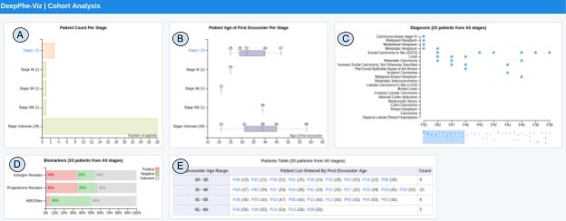
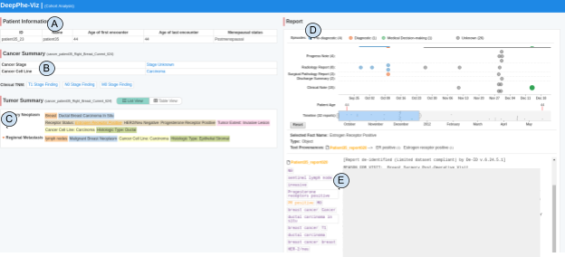

# DeepPhe-Viz v0.2.0

The DeepPhe NLP extracts information from the patient cancer reports and stores the data in Neo4j graph database. The DeepPhe-Viz tool represents the extracted information in an organized workflow to end users, enabling exploration and discovery of patient data.

## Table of Contents

- [Installation](#installation)
  * [Configuration](#configuration)
  * [Starting the Neo4J Database Server](#starting-the-neo4j-database-server)
  * [Launching The Viz Server](#launching-the-viz-server)
  * [Development Mode](#development-mode)
- [Usage And Workflow Instructions](#usage-and-workflow-instructions)
  * [Cohort Analysis](#cohort-analysis)
  * [Individual Patient Profile](#individual-patient-profile)
  
## Installation

You must have the following tools installed:

- [Nodejs 8.12.0 (includes npm 6.4.1)](https://nodejs.org/en/download/) - which the DeepPhe-Viz tool is built upon
- [Neo4j 3.2.13](https://neo4j.com/) - is used to store the graph output from DeepPhe NLP

Currently, we have been successfully using the [nvm](https://github.com/creationix/nvm) tool to configure and manage our NodeJS environment; nvm enables a user to associate a paritcular NodeJS and NPM version with their Unix shell, allowing for each switching between NodeJS versions across different projects.

Next download/clone the `DeepPhe-Viz` repo and enter the project directory/

````
git clone https://github.com/DeepPhe/DeepPhe-Viz.git
cd DeepPhe-Viz
````

Installing this package and all its depedencies can be done with a simple command in the package root directory with no arguments:

````
npm install
````

### Configuration

There are two configuration files under the `configs/` directory:

- `neo4j.josn`
- `server.json`

First you will need to put your neo4j database connection username and password in `neo4j.json`. This assumes that have a running neo4j server and you've loaded the DeepPhe NLP gerenated data (Breast cancer data or Melanoma cancer data) into your Neo4j database. If you have set `dbms.security.auth_enabled=false` for your neo4j installation, you can set the user name and passwords to be empty strings (or ignore them).

The `server.json` is where you can define the HTTP server host and port number.

### Starting the Neo4J Database Server

Put the DeepPhe NLP generated `deepphe.db` under your `NEO4J_ROOT/data/databases/` and configure the `NEO4J_ROOT/conf/neo4j.conf` to point to this database.

Put all the user-defined functions jars under `NEO4J_ROOT/plugings/` before starting the server.

Then go to the `NEO4J_ROOT/bin` and start the database server by using `./neo4j start` command.


### Launching The Viz Server

Now you can start the node server with

````
node server.js
````

This will start the web server on port 8383 by default. You can go to http://localhost:8383/cohortAnalysis to see the result.

Note: you can type `lsof -i :8383` to see if port 8383 is being used. 

### Development Mode

During development, you don't want to restart the server with `node server.js` every time after you make changes in the source code. [Nodemon](https://github.com/remy/nodemon) is a utility that will monitor for any changes in your source and automatically restart your server. Perfect for development. To install, 

````
npm install -g nodemon
````

Then just use `nodemon` instead of `node` to run your code, and now your process will automatically restart when your code changes.

````
nodemon server.js
````

## Usage And Workflow Instructions

The Viz tool consists of two major components-- cohort analysis and individual patient profiles.

### Cohort Analysis

When we first load the Viz tool, you'll see a cohort analysis page. The system queries Neo4j to get all the patients of all cancer stages, and the results are represented in a series of charts.



**A. Patient Count Per Stage**

This chart shows the number of patients of each cancer stage. When users click one of the stage bars in the first chart, the viz tool will show updated charts of that stage with patients from that stage. Users can also click the top-level stage label text to show/hide all its sub-stages. The top stage stays unchanged. Note that some patients may have more than one stage, so the total number across all stages might be larger than the total number of patients in the cohort. 

**B. Patient Age of First Encounter Per Stage**

Box-whisker plots summarizing the distribution of patient age of diagnosis across all cancer stages.

**C. Diagnosis**

The diagnosis chart is a summary of all the diagnosis across all the patient or patients from the selected stage. Moving the bottom slider scrolls through the patients in the X axis.

**D. Biomarkers**

The biomarkers chart is a stacked bar chart that shows the percentage of patients who are positive, negative, and unknown for major biomarkers. Note - as of October 2018, this display is only meaningful for breast cancer data.

**E. Patients Table**

The patient table groups the target patients by their age of first encounter and serves as the entry point to the individual patient profile.

### Individual Patient Profile

Clicking a target patient from the Cohort Analysis patient table, leads to display of the individual patient page.



The patient view starts with personal information on the upper left (A), followed by the cancer summary (B)  and tumor summaries (C). The default tumor summary list view stacks all the tumors and the table view shows comparable items side by side. Similar concepts are grouped and share background colors. Concepts are ordered by importance, and each can be clicked to display their original sources in clinical notes on the right. 

This timeline view (D) provides a temporal view of all of the reports for this patient. Currently we have the following report types:

- Progress Note
- Radiology Report
- Surgical Pathology Report
- Discharge Summary
- Clinical Note

On top of the timeline are horizontal bars representing time spans for episodes, with an interactive legend above. You can toggle the visibility for episode types by clicking on each level. Currently we have the following episode types:

- Pre-diagnostic
- Diagnostic
- Medical Decision-making
- Treatment
- Follow-up
- Unknown

The double-thumb slider below the timeline  can also be used to zoom and scroll through the timeline in more detail.

All information shown in the cohort graphs, cancer and tumor summaries, and patient timeline are extracted from clinical notes or inferred via domain rules.

When you click one of the report dots, the report text is shown underneath the timeline (E) with all of the concepts extracted from the report. Clicking on these terms scauses the document text to scroll to the relevant span.

Note that the text in this example is obscured to protect the privacy of the patient. 

All of the summary items from the full cancer and tumor summaries can also be clicked to show their source report in the timeline.


