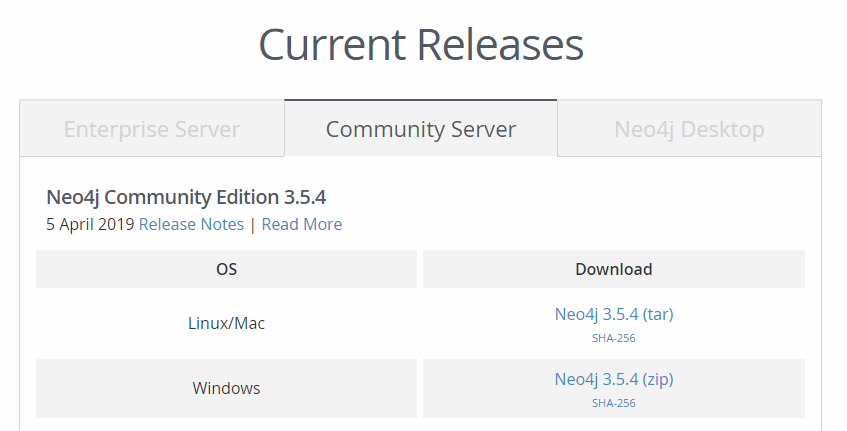
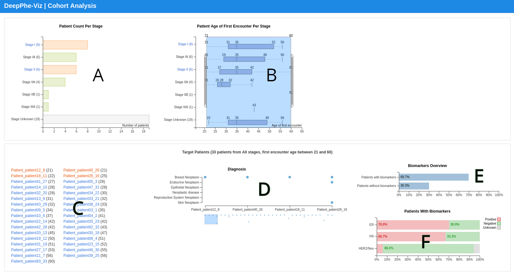

# DeepPhe-Viz v0.2.0

The DeepPhe NLP extracts information from the patient cancer reports and stores the data in Neo4j graph database. The DeepPhe-Viz tool represents the extracted information in an organized workflow to end users, enabling exploration and discovery of patient data.

## Table of Contents

- [Installation](#installation)
  * [Configuration](#configuration)
  * [Starting The Neo4J Database Server](#starting-the-neo4j-database-server)
  * [Launching The DeepPhe-Viz HTTP Server](#launching-the-deepphe-viz-http-server)
- [Usage And Workflow Instructions](#usage-and-workflow-instructions)
  * [Cohort Analysis](#cohort-analysis)
  * [Individual Patient Profile](#individual-patient-profile)
- [For Developers](#for-developers)
  
## Installation

You must have the following tools installed:

- [Nodejs 10.13.0 (includes npm 6.4.1) or the latest LTS version](https://nodejs.org/en/download/) - which the DeepPhe-Viz tool is built upon
- [hapi](https://hapijs.com/) - a framework used by the DeepPhe-Viz tool
- [Neo4j 3.2.x Server](https://neo4j.com/download-center/#releases) - is used to store the graph output from DeepPhe NLP

if you need to manage multiple versions of NodeJS, we have been successfully using the [nvm](https://github.com/creationix/nvm) tool to configure and manage our NodeJS environment; nvm enables a user to associate a paritcular NodeJS and NPM version with their Unix shell, allowing for each switching between NodeJS versions across different projects.

For neo4j server installation, we have tested the "Neo4j Community Edition 3.2.13" with this DeepPhe release, and you can download it from the [Neo4j Releases page](https://neo4j.com/download-center/#releases) by choosing the correct download for your platform. Then follow their [installation instructions](https://neo4j.com/docs/operations-manual/current/installation/) to configure and start the server.



Next download or clone the `DeepPhe-Viz` repo and enter the project directory. Installing this package and all its depedencies can be done with a simple command with no arguments:

````
npm install
````

### Configuration

There are two configuration files under the `configs/` directory: 

- `neo4j.json` is where you specify the neo4j database connection username and password
- `server.json` is where you can define the DeepPhe-Viz HTTP server host and port number

### Starting The Neo4J Database Server

NOTE: the top level directory is referred to as `NEO4J_HOME`, where you see the `bin` and `plugins`.

After building the [DeepPhe system](https://github.com/DeepPhe/DeepPhe-Release/blob/master/README.md), you will have a `deepphe.db` folder generated in the output folder named `output_graph`. Put the generated `deepphe.db` under your `<NEO4J_HOME>/data/databases/` and configure the `<NEO4J_HOME>/conf/neo4j.conf` to point to this database.

````
dbms.active_database=deepphe.db
````

You'll also have a file named `deepphe-viz-0.2.0-plugin.zip` in the directory `deepphe-viz-neo4j/target` after building the [DeepPhe system](https://github.com/DeepPhe/DeepPhe-Release/blob/master/README.md). This compressed file contains a directory named `plugins`.  All the jar files of the `plugins` directory must be copied to `<NEO4J_HOME>/plugins` directory. The DeepPhe-Viz uses these libraries to interact with the customized DeepPhe system database.

To run Neo4j as a console application, use:
`./<NEO4J_HOME>/bin/neo4j console`

To run Neo4j in a background process, use:
`./<NEO4J_HOME>/bin/neo4j start`

Once you create a new password for the 'neo4j' user upon visiting the Neo4j Browser at http://localhost:7474 the first time, you'll have full access to the Neo4j database. The same username and password will also need to be configured in the DeepPhe-Viz configuration file: `configs/neo4j.json` so the DeepPhe-Viz can talk to the neo4j server.

### Launching The DeepPhe-Viz HTTP Server

Now you can start the DeepPhe-Viz HTTP server with

````
node server.js
````

This will start the web server on port 8383 by default. You can go to http://localhost:8383/cohortAnalysis to see the result. We'll describe the usage and workflow later.

Note: you can type `lsof -i :8383` to see if port 8383 is being used. If you need to use a different port for running the DeepPhe-Viz HTTP server, specify the port number in the DeepPhe-Viz configuration file: `configs/server.json` then restart the DeepPhe-Viz HTTP server.

## Usage And Workflow Instructions

The Viz tool consists of two major components&mdash;cohort analysis and individual patient profiles. Please note that the DeepPhe NLP may extract multiple cancers of the same patient if present. Currently the Viz tool can render multi-cancer patient in the individual patient profile to show all the cancers and tumors summaries. However, the cohort analysis page doesn't take this into consideration at this point. We are working on a comprehensive solution to the multi-cancer cases.

### Cohort Analysis

When we first load the DeepPhe-Viz in the web browser, you'll see a cohort analysis page. The system queries Neo4j to get all the patients of all cancer stages, and the results are represented in a series of charts.



**A. Patient Count Per Stage**

This chart shows the number of patients of each cancer stage. When users click one of the stage bars in the first chart, the viz tool will show updated charts of that stage with patients from that stage. Users can also click the top-level stage label text to show/hide all its sub-stages. The top stage stays unchanged. Note that some patients may have more than one stage, so the total number across all stages might be larger than the total number of patients in the cohort. 

**B. Patient Age of First Encounter Per Stage**

Box-whisker plots summarizing the distribution of patient age of diagnosis across all cancer stages.

**C. Diagnosis**

The diagnosis chart is a summary of all the diagnosis across all the patient or patients from the selected stage. Moving the bottom slider scrolls through the patients in the X axis.

**D. Biomarkers**

The biomarkers chart is a stacked bar chart that shows the percentage of patients who are positive, negative, and unknown for major biomarkers. Note - as of October 2018, this display is only meaningful for breast cancer data.

**E. Patients Table**

The patient table groups the target patients by their age of first encounter and serves as the entry point to the individual patient profile.

### Individual Patient Profile

Clicking a target patient from the Cohort Analysis patient table, leads to display of the individual patient page.


The patient view starts with personal information on the upper left (A), followed by the cancer summary (B)  and tumor summaries (C). The default tumor summary list view stacks all the tumors and the table view shows comparable items side by side. Similar concepts are grouped and share background colors. Concepts are ordered by importance, and each can be clicked to display their original sources in clinical notes on the right. 

This timeline view (D) provides a temporal view of all of the reports for this patient. Currently we have the following report types:

- Progress Note
- Radiology Report
- Surgical Pathology Report
- Discharge Summary
- Clinical Note

On top of the timeline is an interactive episode legend. You can toggle the visibility for episode types by clicking on the episode circle, you can also zoom in/out the reports of each episode by clicking the legend text. Currently we have the following episode types:

- Pre-diagnostic
- Diagnostic
- Medical Decision-making
- Treatment
- Follow-up
- Unknown

The double-thumb slider below the timeline  can also be used to zoom and scroll through the timeline in more detail.

All information shown in the cohort graphs, cancer and tumor summaries, and patient timeline are extracted from clinical notes or inferred via domain rules.

When you click one of the report dots, the report text is shown underneath the timeline (E) with all of the concepts extracted from the report. Clicking on these terms scauses the document text to scroll to the relevant span.

Note that the text in this example is obscured to protect the privacy of the patient. 

All of the summary items from the full cancer and tumor summaries can also be clicked to show their source report in the timeline.


## For Developers

If you would like to poke around the Viz tool and make changes to the source code, you must don't want to restart the server with `node server.js` every time after code changes. [Nodemon](https://github.com/remy/nodemon) is a utility that will monitor for any changes in your source and automatically restart your server. Perfect for development. To install, 

````
npm install -g nodemon
````

Then just use `nodemon` instead of `node` to start the server, and now your process will automatically restart when your code changes.

````
nodemon server.js
````


